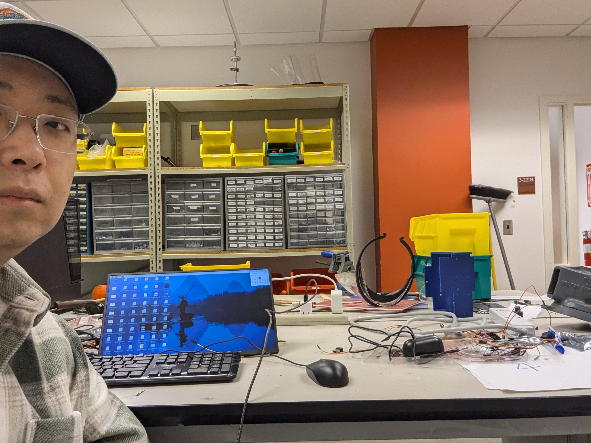
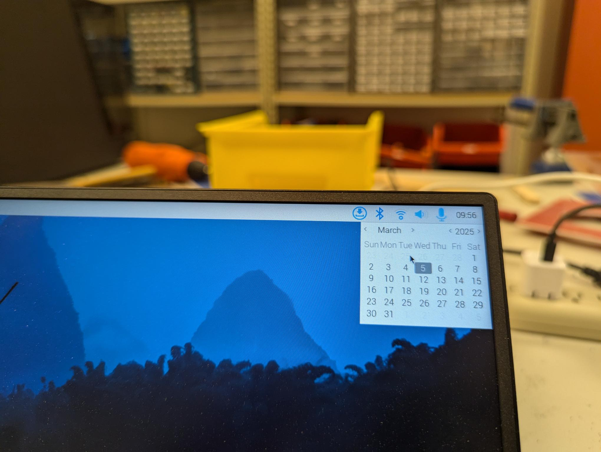
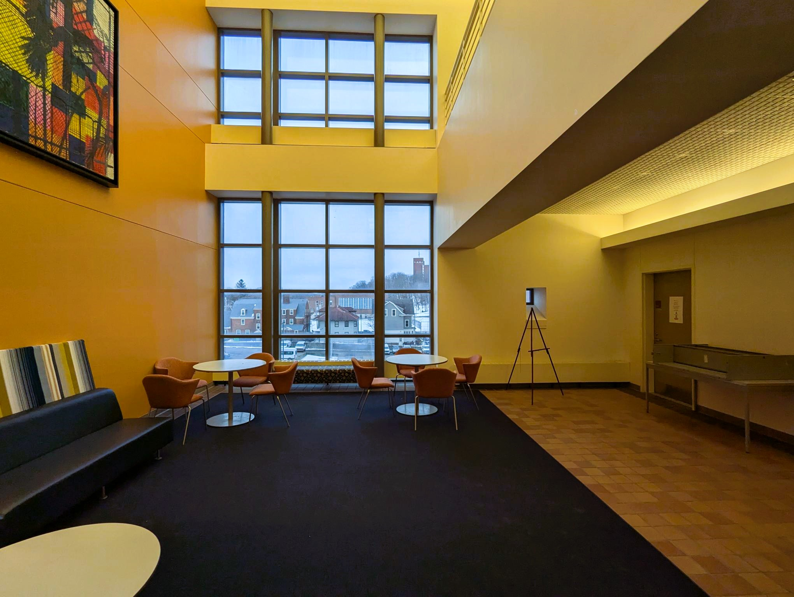

# CSE 398 Design Project

-------
**Lab staff: Yue Cao, Jiamin Zhao**

**Spring 2026, Syracuse University**

-------------

#### 1. Project Overview

The Design Project expects you to demonstrate your comprehensive skills on Computer Engineering. It is a prerequisite for the Senior Design. It can be a valuable highlight on your resume.

The Design Project starts right after the Spring Break. The Design Project ends at the last day of the class, **Wednesday, Apr. 22**.

----------

#### 2. Project Commitment

- [ ] Students should attend and actively work during the regular lab session on Monday and Wednesday. If not, you need provide justified reason and make it up in other hours.

- [ ] Every Wednesday, students will have a 10 minutes group meeting with lab instructor and TA. The group meeting will review your last-week work and discuss next-week plan. Every group member needs to be present.

- [ ] Every student in a group is expected to complete **10 hours lab work** per week. 
	  Considering a group of 3 and 5 weeks, your project is expected to be 3 x 10 x 5 = **150 person-hours**.
	
- [ ] Every week, **every student** needs to maintain an **individual Markdown** to record your progress. The Markdown is still due every Monday evening.
	
- [ ] Every week, **every student** needs submit an **individual Work Timesheet** on their own, in word/pdf format.
	
	The Work Timesheet includes:

 	* All working hours, in-class and out-of-class. As well as brief statement of the work. 
 	
 	  >Cao worked on Feb 24 12:45-3:45pm, Feb 25 7-9 pm, Feb 26 1-5 pm. 
 	  >* Feb 24 12:45-3:45pm (in class): I tried to use OpenCV to record video.
 	  >* Feb 26 12:45-3:45pm (in class): I studied OpenCV documents on Haar Cascade. (It is counted that you just study some documents/watch other's walk thru video)
 	  >* Feb 27 1-5 pm (out of class): I tried to implement Haar Cascade in Pi but failed. (It is counted that the trial failed, just say it)
 	
 	* Photo proof of all out-of-class hours.
 	  
 	  >* A set of Photo proof needs to contain: 1, one pic of your selfie with lab as background; 2, one pic of your raspberry pi time with lab as background.
 	  >* Each set of Photo proof can mostly cover 3-hour period.
 	  >* For example, if I work Feb 27 1-5 pm, I need two sets of Photo proofs: one set covering 1-4 pm, one set covering 4-5pm.

| **selfie with lab background** |**pi time with lab background** |
|---------|---------|
|  |  |
----------

#### 3. Project Specifications

- [ ] Your project should be centered on Pi 5.
	

 	Your project **must** leverage the unique advantages of the **Raspberry Pi 5**.
 	
 	If your project can be implemented using **cheaper alternatives** such as an Arduino, **it is not valid**.

- [ ] Your project should be able to be demonstrated in a **small space** (2x2 meters)
	
	We  will use the **open space right outside the 3rd-floor elevator and the hallway** for demo. This space is shared by 10 groups. 
	
	Also consider leave space for audience.
	
- [ ] Your project should demonstrate good system-level integration, combining hardware components and software implementation into a functioning system

	* For the **hardware**, you need to have at least **2 different types of peripherals**.

	    **These can be considered:** I2C-connected device, Serial-connected device, SPI-connected device, WiFi-communicated device, Bluetooth-communicated device, Motor, Camera, Microphone, Speaker, ...
  
	    **These are not counted:** LED, push button, buzzer, standard keyboard, mouse, standard Monitor, battery.
	
	* For the **software**, the implementation must demonstrate a **sufficient level of complexity**.

	    Simple coding is not acceptable.
	    
	    You should consider extra feature
	    
	* Your overall system should incorporate advanced features such as:

	    ** Automation 
	
	    ** Intelligence
	    
	    ** A well-designed and user-friendly interface
	
	    **Integration of emerging technologies introduced in recent years

- [ ] Your project needs to adhere to Ethics guidelines
	
- [ ] Advice: Choose a topic that all team members are truly interested in.

----------

#### 4. Grade Breakdown

The design project take up 50% of the final grade.

It is distributed as:

* Proposal Presentation  **5 %**: group presentation
* Individual Weekly Markdown & Work Timesheet  **15%**: A student will lose points per week if not showing enough commitment individually.
* Final Poster  **5%**: group
* Final Report  **5%**: individual report
* Final Demo **10%**: will be judged by lab staff, other faculty, out-of-class students.
* Professional Contribution Assessment **10%**: evaluated jointly by the lab instructor, lab TA, and peer evaluation from group members.

-------------

#### 5. Project Agenda and Dues

## 📅 Design Project Timeline (Spring 2026)

| Date             | Activity                       | Deliverables                                                       |
| ---------------- | ------------------------------ | ------------------------------------------------------------------ |
| **Mar 18 (Wed)** | In-class proposal presentation     | Project proposal planning meeting                                  |
| **Mar 23 (Mon)** | In-class proposal presentation | Proposal slides (Blackboard)   Parts / order request submission |
| **Mar 25 (Wed)** | In-class project meeting       | —                                                                  |
| **Mar 30 (Mon)** | —                              | Group Markdown update   Individual Work Timesheet               |
| **Apr 1 (Wed)**  | In-class project meeting       | —                                                                  |
| **Apr 6 (Mon)**  | —                              | Group Markdown update   Individual Work Timesheet               |
| **Apr 8 (Wed)**  | In-class project meeting       | —                                                                  |
| **Apr 13 (Mon)** | —                              | Group Markdown update   Individual Work Timesheet               |
| **Apr 15 (Wed)** | In-class project meeting       | —                                                                  |
| **Apr 20 (Mon)** | —                              | Final Group Markdown update   Final Individual Work Timesheet   |
| **Apr 22 (Wed)** | 🎯 **Demo Day**                | Final project demonstration                                        |

-------------

#### 6. Order Request

Each group can request 50 USD (max 5 items) purchase from the department. The order needs to be reviewed and approved. 

Groups are strongly encouraged to consider purchasing items on their own due to the possible delay in department purchase.

You can request purchase from the following vendors: 

* Amazon (1 week or more shipping time)
* Adafruit (2 weeks or more shipping time)
* SparkFun Electronics (2 weeks or more)
* DigiKey (2 weeks or more)
* https://robotis.us/  (2 weeks or more )
* Pololu Robotics and Electronics (2 weeks or more)

After Demo Day, all projects will be disassembled and lab components will be returned to inventory.

Components purchased personally by students will be returned to the individual owner.

If you would like to keep your full project, you must purchase all hardware components yourself, including the Raspberry Pi.

If you would like to keep your microSD card only, you must provide a replacement microSD card so that the lab inventory can be restored. 

acceted types: Samsung EVO Select microSD 64 GB or 128 GB
Sandisk Ultra microSD 64 GB or 128 GB
both speed should be >100 MB/s