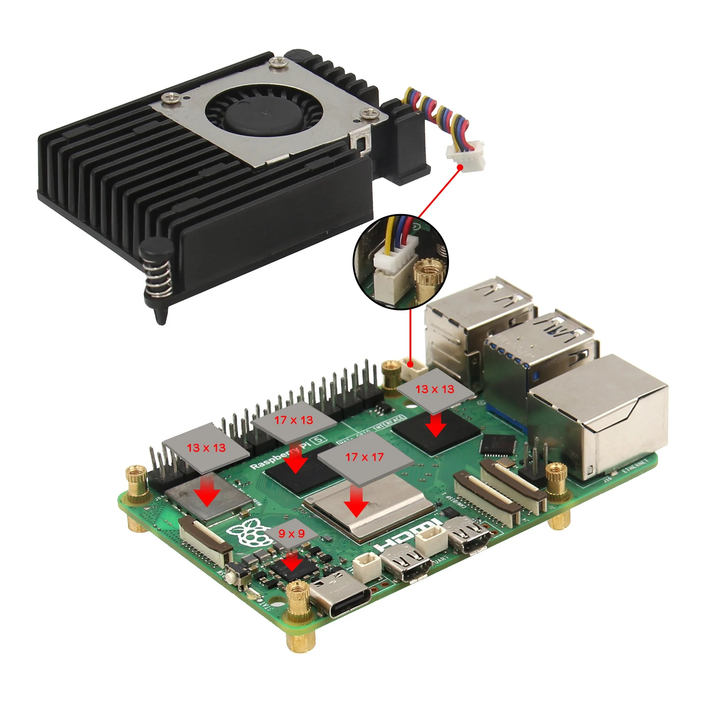

# Week 2 Wed Raspberry Pi Setup

---------------
#### :dizzy: **Lab Date :** Jan 21 Wednesday
#### :alarm_clock: **Due Date :** 2:00 pm Jan 26   
#### :pencil: Every group member must be present for every check point.
-------------------

## 1. Preparation
- [ ] **Unpack your Pi 5**

- [ ] **Install Pi cooler**  

The cooler is Geekworm Active Cooler H505. Installed as this picture:

Extra Note:
* Stick 5 pieces thermal pads first, then mount the cooler.
* If the 9x9 thermal pad is too small for you to put, it can be ignored.
* yellow wire near the outside edge of the board, not the red wire.

## 2. Set MicroSD card 
- [ ] **Image Raspberry Pi OS into microSD card**
   Follow the official guide: 
  https://www.raspberrypi.com/documentation/computers/getting-started.html#installing-the-operating-system 
    You need to use your own laptop to image. The lab desktop has no admin authorization.
    Our lab micrcSD card is in fast speed. It won't take too much time to install.

    
  
  
- [ ] **Insert MicroSD card into the slot of your Pi**

## 3. Connect and Start your Pi 
- [ ] **Connect mouse, keyboard**

- [ ] **Connect monitor**
   use the HDMI port on the desk Monitor.  Keep the VGA still connected to the desktop.

- [ ] **Connect power adapter**

- [ ] **Power on your Pi and finish use name/password set up**
   Every group member must save a copy of your username/password

- [ ] **Connect the iot Wifi**
   Wifi password is provided on Blackboard 

🎉 **Check Point 1**
 Show lab staff once you successfully enter the Desktop screen of the Pi.
 Return the SD card reader to lab staff.

## 4. Install Software in your Pi 
- [ ] **Install Pi-Apps**
 You can consider Pi-Apps as something like Google Play Store in Android or App Store in IOS.
 It has many software that can be easily installed.
 follow the command line at this link to install Pi-Apps:
  https://pi-apps.io/install/ 

- [ ] **Install any Markdown software**
   Obsidian is default offered in Pi-Apps.
   It can be installed without command line.  
   You can also install Typora or something else.

   Create a new .md file, do the following: 
1. Refer to [Example Markdown Guide](../Lab%20Info/example%20markdown.md) , to type down your header</li>
2. Type the username and password of your Raspberry Pi.</li>
3. Convert to .PDF format</li>
4. Submit to BlackBoard</li>

:pushpin: Since next lab, every thing you conduct need to be recorded in your Markdown.

🎉 **Check Point 2**
 Show lab staff your installation and Markdown.

🎉 **Extra**
  This section is optional. If you are interested, there are several ways to access your Raspberry Pi remotely, instead of using the lab monitor.
  Method 1: SSH; Method 2: VNC screen share; Method 3: ``Raspberry Pi Connect`` with an account
  Details can be found on: https://www.raspberrypi.com/documentation/computers/remote-access.html

---
