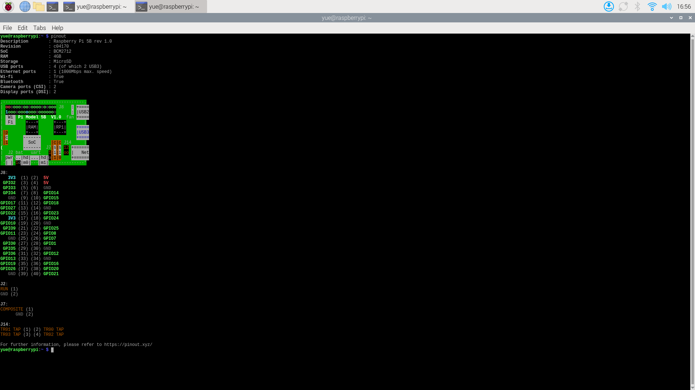

# Week 3 Wed GPIO

---------------
#### :dizzy: **Lab Date :** Jan 28 Wednesday
#### :alarm_clock: **Due Date :** 2:00 pm Feb 2 (next Monday)   
#### :pencil: Every group member must be present for every check point.
-------------------

## 1. GPIO Pins

In the CLI terminal, type `pinout` to display the GPIO pinout of your Raspberry Pi.

> **Note:** On the physical board, you will see the silkscreen label **`J8`** next to the GPIO header. This label indicates the orientation of the pinout columns shown in the `pinout` output.

Or you can just Google Search "raspberry pi 5 pinout"`.




## 2. GPIO Zero Library

In the Raspberry Pi OS, you can use ``GPIO Zero`` library in Python to control the GPIO pins.

Simple examples with code are provided in the official repo of Raspberry Pi:

https://github.com/raspberrypi/documentation/blob/master/documentation/asciidoc/computers/os/using-gpio.adoc

Now, try all 3 examples (LED control/ Read button state / Control) an LED with a button)given in that link.

🎉 **Check Point 1**
<br>Show lab staff all 3 examples

----------


## 3. Create a Python Class

Next, you will create a custom Python Class, (for example, named `double_LED`). It can control 2 LEDs using ``gpiozero``.

This Python Class should meet these requirements:

##### -GPIO Configuration

The class constructor must accept GPIO pin numbers as arguments. For example:

  ```python
  my_LED_object = double_LED(17, 27)
  ```
##### -Required Methods

The class implements these 2 public methods:

```python
my_LED_object.blink_together() #Both LEDs blink ON and OFF simultaneously
my_LED_object.blink_one_by_one() #LEDs blink sequentially, one ON at a time
```


🎉 **Check Point 2**
<br> Demo the result and explain the code. You may be asked to modify the code.
<br> Return all LEDS/buttons/others back to the proper place.
---
:pushpin: Covert your Markdown to PDF and submit to BlackBoard as a group. 
