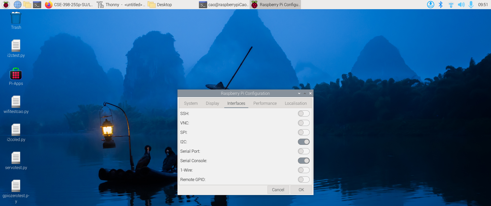
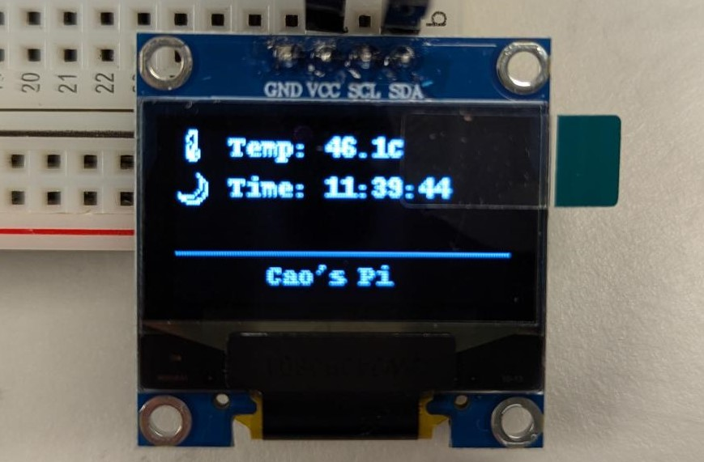

# Week 3 Mon I²C

---------------
#### :dizzy: **Lab Date :** Feb 2 Monday
#### :alarm_clock: **Due Date :** 2:00 pm Feb 9 (next Monday)   
#### :pencil: Every group member must be present for every check point.
-------------------

## 1. I2C - Basic set-up 
- [ ] **Hardware set-up**
  <br>You will play with a I²C based OLED display. 
  <br>It is this product:
  <br>0.96 Inch OLED I2C IIC Display Module 12864 128x64 Pixel SSD1306 Mini Self-Luminous OLED Screen 
  <br>https://www.amazon.com/dp/B09T6SJBV5?th=1 
  <br> Connect it with your Pi using breadboard (as an intermediate connection) and jump wires.

| **Pin** | **Description**   |                                                                                                                     
| ------- | -------------------|
| **GND**             | Ground |  
| **VCC**             | 3.3 V or 5 V  |
| **SCL**             | I²C Clock |
| **SDA**             | I²C Data |


- [ ] **Pi OS Configuration**
  <br>You need to turn on the I2C in the Pi OS firstly.
  <br>Go to your top left menu, you can find ```Preferences``` -> ```Raspberry Pi Configuration```.
    
  
- [ ] **I2C Detect**
<br>```i2cdetect``` is a tool avaiable in Pi OS.
<br>It can quick check your I2C communication in the Terminal. 

```shell
cao@raspberrypiCao:~ $ i2cdetect -l
i2c-1	i2c       	Synopsys DesignWare I2C adapter 	I2C adapter
i2c-11	i2c       	107d508200.i2c                  	I2C adapter
i2c-12	i2c       	107d508280.i2c                  	I2C adapter
```
You should see ```i2c-1```, this is the i2c corresponding to your GPIO pins.
Then check if the device is in the correct address, 1 indicate the ```i2c-1```:
```shell
cao@raspberrypiCao:~ $ i2cdetect -y 1
```
You should see ```0x3C``` address is there.

The value `0x3C` is the default I²C address assigned to the SSD1306 OLED IC. If this address is detected, it confirms that your OLED device is communicating with the main board via I²C.

🎉 **Check Point 1**.

## 2. I2C - A Status Monitor 
**Overall, In the design, you need to realize a Status Monitor system:**
<br> This OLED displays the temprature of your PI and real time.  




- [ ] **adafruit_ssd1306 package**
<br>To code that I2C-based OLED in Python, you need to firstly install adafruit_ssd1306. This enables the SSD1306 display driver via the Adafruit CircuitPython framework.

```shell
cao@raspberrypiCao:~ $ pip3 install adafruit-circuitpython-ssd1306 --break-system-packages
```
- [ ] **Simple Display Example**
<br> Start from a simple one in Python - just display "Hey There" on your screen.
<br> More detailed explanation can be found at https://learn.adafruit.com/monochrome-oled-breakouts/python-usage-2

```python
import board
import busio
import adafruit_ssd1306
from PIL import Image, ImageDraw, ImageFont

# Create the I2C interface
i2c = busio.I2C(board.SCL, board.SDA)
# Create the SSD1306 OLED class
oled = adafruit_ssd1306.SSD1306_I2C(128, 64, i2c)

# Clear the display (0 for pixel off/black, 255 for pixel on/white)
oled.fill(0)
oled.show()

# Create a blank image for drawing (mode '1' for 1-bit color/black & white)
image = Image.new("1", (oled.width, oled.height))
draw = ImageDraw.Draw(image)

# Draw the text
# syntax: draw.text((x, y), text, font=font, fill=255)
font = ImageFont.load_default()
draw.text((40, 0), "Hey", font=font, fill=255)
draw.text((80, 30), "There", font=font, fill=255)

# Display the image
oled.image(image)
oled.show()
```

- [ ] **Display Real-Time Status**
<br> Try to get the real-time status:
1. temperature of the Pi; 2. Time.
<br> Display these info on the screen.

- [ ] **Add Emoji**
<br> Plain text may look boring. You can add some emojis.
<br> Download Google Noto Emoji font
<br> https://fonts.google.com/noto/specimen/Noto+Emoji
<br> Un-zip and place the ```NotoEmoji-Regular.ttf``` in the same folder as your code file.
<br>You can then write emoji using Unicode and display it with PIL package on your screen.
<br>You can find the Unicode lookup here: https://www.unicode.org/charts/PDF/U1F300.pdf

```python
emoji_font_path = "NotoEmoji-Regular.ttf"  
emoji_font = ImageFont.truetype(emoji_font_path, 10)  # you can adjust font size for better display

## Suppose your PIL ImageDraw object is named "draw"
draw.text((0, 15), "\U0001F319", font=emoji_font, fill=255)

```
You don't need to use the exact same emojis in the example picture.<br> Feel free to use any fun emojis you like!

- [ ] **Improve display**
<br> Arrange your information and emojis for better visual appeal.
<br> Feel free to adjust the layout as you want.
<br> No need  to strictly follow the placement shown in the example picture.

🎉 **Check Point 2** Every group member will be asked to explain a piece of code. Also show the **I²C inspection via Analog Discovery**.

Carefully disconnect the OLED and properly organize the items before you leave.
