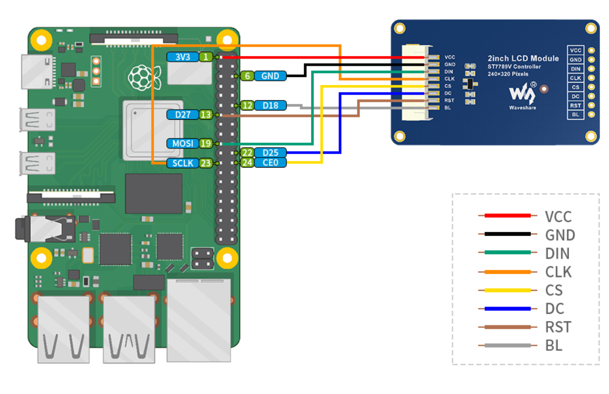

# Week 3 Wed SPI

---------------
#### :dizzy: **Lab Date :** Feb 4 Wednesday
#### :alarm_clock: **Due Date :** 2:00 pm Feb 9 (next Monday)   
#### :pencil: Every group member must be present for every check point.
-------------------

## 1. SPI - Basic set-up
- [ ] **Hardware intro**
   You will play with a SPI based LCD display. 
   It is this product:
   Waveshare 2inch Mini LCD Screen - 240x320 Resolution IPS LCD Display, 262K RGB Color, Embedded ST7789VW Driver, SPI Interface.
   https://www.amazon.com/dp/B082GFTZQD?th=1
- [ ] **Hardware connection**
   Follow the official guide to connect https://www.waveshare.com/wiki/2inch_LCD_Module
    Or direct refer to their pin-connection image here.

| Note: Your wire coloring may be different | 
|---------------------|
|  |
- [ ] 
----------

🎉 **Check Point 2**
 Each student will show the basic operations to the lab staff.

