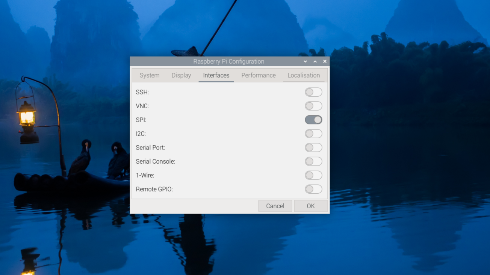

# Week 3 Wed SPI

---------------
#### :dizzy: **Lab Date :** Feb 4 Wednesday
#### :alarm_clock: **Due Date :** 2:00 pm Feb 9 (next Monday)   
#### :pencil: Every group member must be present for every check point.
-------------------

## 1. SPI - Basic set-up
- [ ] **Hardware intro**
  <br>You will play with a SPI based LCD display. 
  <br>It is this product:
  <br>Waveshare 2inch Mini LCD Screen - 240x320 Resolution IPS LCD Display, 262K RGB Color, Embedded ST7789VW Driver, SPI Interface.
  <br>https://www.amazon.com/dp/B082GFTZQD?th=1
- [ ] **Hardware connection**
  <br>Follow the official guide by Waveshare to connect 
  <br> https://www.waveshare.com/wiki/2inch_LCD_Module
  <br> Or directly refer to the pin-connection image below.

| Note: Your wire coloring may be different | 
|---------------------|
|  |

 

- [ ] **Pi OS Configuration**
  <br>You need to turn on the SPI in the Pi OS firstly.
  <br>Go to your top left menu, you can find ```Preferences``` -> ```Raspberry Pi Configuration```.
    

  <br> At this point, you may already see the LCD backlight turn on (although no image displayed yet).


## 2. SPI - Simple image display
- [ ] **Don't** follow the software setup in the official guide by Waveshare. It overcomplicates things.
- [ ] Download the example code from Waveshare
      
```bash
wget https://files.waveshare.com/upload/8/8d/LCD_Module_RPI_code.zip
```
     
 - [ ] Extract the files.
 - [ ] Navigate to the folder ```LCD_Module_RPI_code/RaspberryPi/python/example``` and Run "2inch4_LCD_test.py"
 - [ ] You will now see an image!
 - [ ] Try to modify the code and use AI tools to help you understand what each part does.

🎉 **Check Point 1**
<br>Each student will be asked regarding to the code

