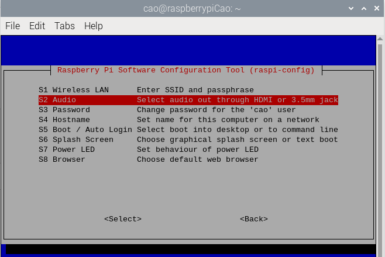

# Week 7 Mon: Speech Recognition

---------------
#### :dizzy: **Lab Date :** Feb 23
#### :alarm_clock: **Due Date :** 2:00 pm Mar 2   
#### :pencil: Every group member must be present for every check point.
-------------------


## 1. Basic Setup: Servo and Arduino

In this task, you will do such basic set-up

## 1. Configure Audio Devices

We have:

* Adafruit Mini USB Microphone: https://www.adafruit.com/product/3367

- [ ] **Second configure the microphone.**

Start with checking all audio input:

```shell
cao@raspberrypiCao:~ $ arecord -l
```

You should see ```USB Audio [USB Audio]``` in the list. My terminal shows:

```shell
**** List of CAPTURE Hardware Devices ****
card 0: Device [USB PnP Sound Device], device 0: USB Audio [USB Audio]
  Subdevices: 1/1
  Subdevice #0: subdevice #0
```

From here, you need to know it is labeled as ```card 0``` and ```device 0```.

Then run this command line to record an audio file, here the 2 numbers in ```plughw:0,0 ``` responding to the previous ```card 0``` and ```device 0```

```shell
cao@raspberrypiCao:~ $ arecord -D plughw:0,0 -f cd test.wav
```

You can Ctrl+C to stop recording. Then listen to the audio in your folder.
```

You should see ```USB Audio [USB Audio]``` in the list.

Your Audio output may de default set as the Minitor's HDMI. If so,

```shell
cao@raspberrypiCao:~ $ sudo raspi-config
```



Go to **1 System Options** , Then **S2 Audio** Then adjust settings.

Then run this testing Commond Line, or just play any YouTube video:

```shell
cao@raspberrypiCao:~ $ speaker-test -c2 -twav
```

