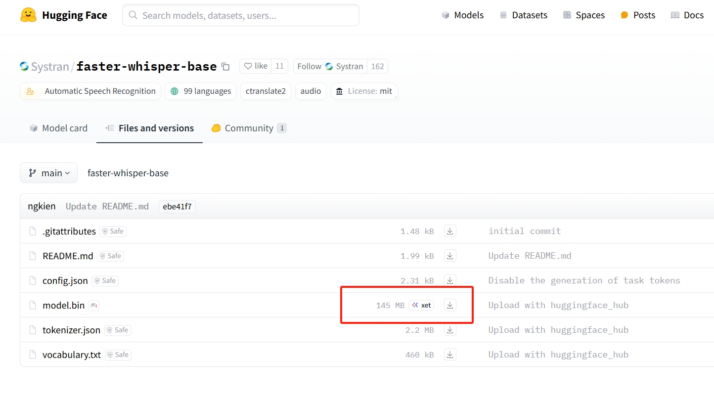
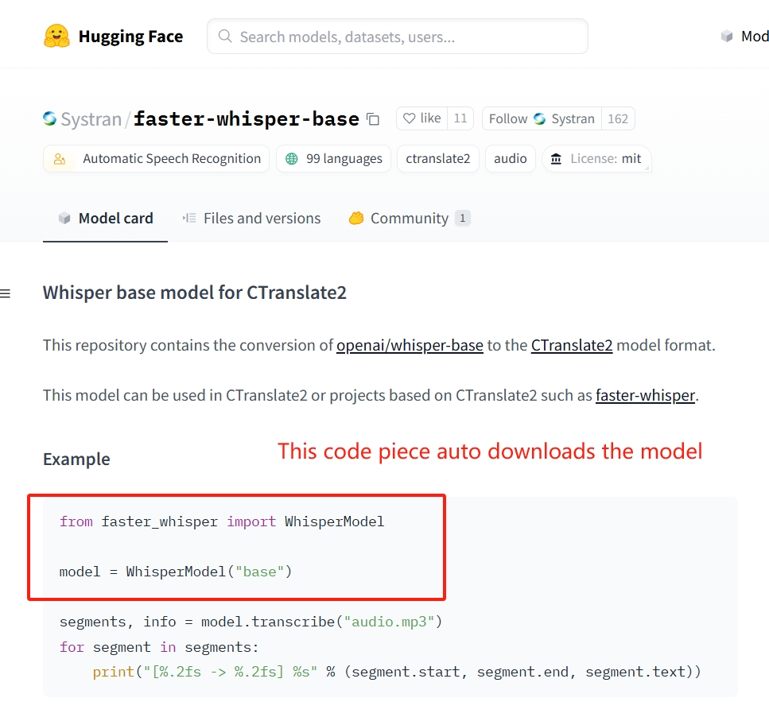

# Week 7 Mon: Speech Recognition

---------------
#### :dizzy: **Lab Date :** Feb 23
#### :alarm_clock: **Due Date :** 2:00 pm Mar 2   
#### :pencil: Every group member must be present for every check point.
-------------------

## 1. Configure Audio Devices

We have Adafruit Mini USB Microphone: https://www.adafruit.com/product/3367

- [ ] **Configure the microphone.**

Start with checking all audio input:

```shell
cao@raspberrypiCao:~ $ arecord -l
```

You should see ```USB Audio [USB Audio]``` in the list. My terminal shows:

```shell
**** List of CAPTURE Hardware Devices ****
card 0: Device [USB PnP Sound Device], device 0: USB Audio [USB Audio]
  Subdevices: 1/1
  Subdevice #0: subdevice #0
```

From here, you need to know your USB mic is labeled as ```card 0``` and ```device 0```.


- [ ] **Record a sample audio clip**

Run this command line to record an audio file, here the 2 numbers in ```plughw:0,0 ``` responding to the previous ```card 0``` and ```device 0```. `-t 5` sets 5-second record.

```shell
ffmpeg -f alsa -i plughw:0,0 -t 5 output_feb_21_a.mp4
```

- [ ] **Check the recorded audio clip**
You can play the audio and check whether it has been recorded.

Your Audio output may de default set as the Minitor's HDMI. Check it with:

```shell
sudo raspi-config
```

In "System Options -> S2 Audio" :


If your Monitor cannot play audio, you can simply open a `http.server`, download the audio to your own laptop, and then play it.

## 2. Install and Use ```faster-whisper```

OpenAI developed Automatic Speech Recognition models called ```whisper``` :

https://platform.openai.com/docs/guides/speech-to-text

```faster-whisper``` is a GitHub project that re-implements OpenAI's ```whisper``` model and works faster and more suitable for embeded devices:

https://github.com/SYSTRAN/faster-whisper 

- [ ] **pip3 install**

Do such in Terminal:

```shell
cao@raspberrypiCao:~ $ pip3 install faster-whisper --break-system-packages
```

- [ ] **Look thru models**

The Speech Recognition models are not defaulty downloaded in your Pi.

You need to be aware which models are situable for your Pi.

In Python,

```python
from faster_whisper import available_models

print(available_models())
```

These printed models, they are actually hosted on ```Huggingface``` website:

https://huggingface.co/Systran 

For each listed model, you can clicked into:

* In **Files and versions**, you can see their download size. Better avoid download something over 1 GB. It would be too much for your Pi.
  <kbd></kbd>
* In **Model card**, if you run the Python code piece in Example, it will automatically download the model to your Pi.
  <kbd></kbd>

- [ ] **Download models**
<br> The `faster-whisper-tiny.en` and `faster-whisper-base.en` are two well-suited models for your Rasp Pi.
<br> the '.en' means they only works for English.
<br> Download them.

------------  
- [ ] **Check models**

After downloading the models, use our USB microphone and record a 10 seconds audio.

Do such code. Check Comments:

```python
from faster_whisper import WhisperModel

model_size = "base.en"   # change 1: English-only
model = WhisperModel(model_size, device="cpu", compute_type="int8")

segments, info = model.transcribe(
    "output_feb_21_a.mp4",
    beam_size=5,
    temperature=0.0      # change 2: deterministic decoding
)

for segment in segments:
    print("[%.2fs -> %.2fs] %s" % (segment.start, segment.end, segment.text))

```

🎉 **Check Point 1**
