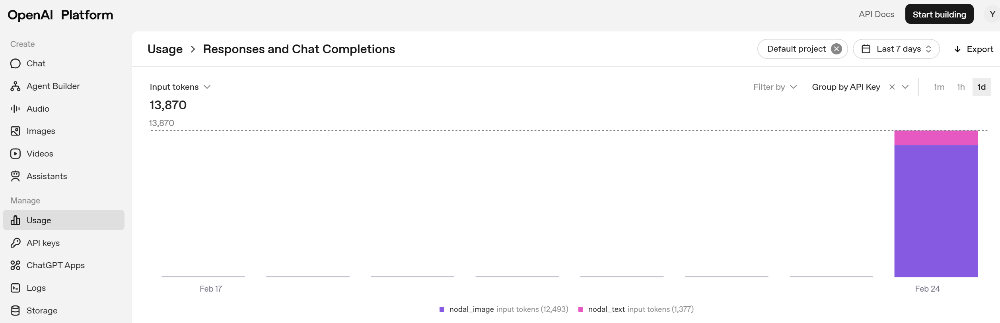
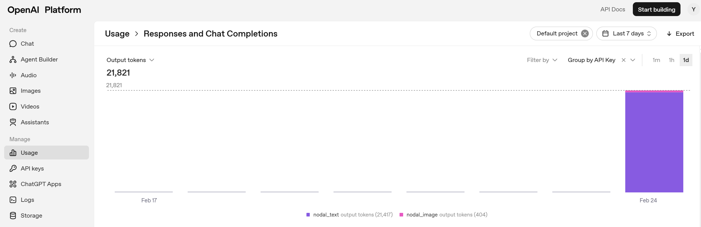

# Week 7 Wed: LLM

---------------
#### :dizzy: **Lab Date :** Feb 23
#### :alarm_clock: **Due Date :** 2:00 pm Mar 2   
#### :pencil: Every group member must be present for every check point.
-------------------

## 0. Preparation

- [ ] Choose any api-based LLM on your preference, such as Open AI, Gemini, Claude, ...

- [ ] Create 2 api keys: one key for Task 1.. Text-based Input
You don't need to show the api key in the Markdown submission.

- [ ] The Task today is to
* **Develop** an LLM-based **EE Circuit tutor** for students; 
* and **Access** the performce of the LLM in on domain-specific tasks (circuit analysis ).
  
- [ ] We have prepared materials in course GitHub repo "Regular Lab Phase -> Asset".
	 10 circuits in total. Each circuit is represented by 2 formats:
	* SPICE (text based format)
	* Image (screenshot from LTSpice software)

- [ ] The circuits are from the open-access textbook: *"Circuit Analysis and Design, 3rd Edition, Umich Publication"* https://services.publishing.umich.edu/Books/Electrical-Engineering-Textbooks

- [ ] There is no depedent sources in all the given circuits. Circuits solutions are given in the BlackBoard for references.

------

## 1. Text-based Input

- [ ] Use an LLM model, create a system that:

* Accepts a SPICE-format netlist input.
* Performs **Nodal Analysis** with correct math.
* Provide structured, student-understandable text output that clearly explains the solving procedure.
* Try to make as many as answers to be correct

- [ ] For the Markdown submission, provide the full code. If your prompt is stored in a separate file, explicitly show it.
- [ ] For the Markdown submission, you only need to include **2 LLM outputs of the 10 circuits**.

- [ ] Create a Markdown table to report:

*You have taken ELE 231. So you will act as the domain expert to evaluate the LLM’s performance*

| Circuit # | Final node voltages (V) | Correct? (Y/N) | Mismatch reason |
| --------: | ---------------------------------------- | :----------------------: | ---------------------------- |
|         1 | V(n1)=...; V(n2)=...          |           Y / N          |  ... | 
|         ... | ...      |         ...       |  ... | 

* [ ] Compute:

$$\text{Accuracy} =\frac{\text{Correct circuits}}{10} $$

* [ ] Token usage:

Report the token usage data during your experiment for this task.
  Especially the input token, output token, price.
  You can provide screenshot the data from the platform webpage.

| Example from OpenAI Platform: Input Token per API |  
|---------------------|
|  | 

| Example from OpenAI Platform: Output Token per API |  
|---------------------|
|  | 

> If can also correctly perform **Mesh Analysis**, and report the same style Table in Markdown.
>
> can get **3/20 extra points back** in one single previous Markdown submission. (reach out to TA to recover your points)

🎉 **Check Point 1**
  Show your work, including Table in Markdown.
  Describe your work individually.
  Failure to demonstrate meaningful contribution, or answer questions will result in point loss in the corresponding Markdown submission.

-------

## 2. Image-based Input

- [ ] The requirements of Task 2 are the same as Task 1, except the input format changes from text-based netlist to image-based circuit schematic.

- [ ] Low accuracy is acceptable due to challenges in image understanding.

- [ ] Report the same things as Task 1: Detail Table, Accurancy, Token usage

🎉 **Check Point 2**

  Show your work, including Table in Markdown.
  Describe your work individually.
  Failure to demonstrate meaningful contribution, or answer questions will result in point loss in the corresponding Markdown submission.
