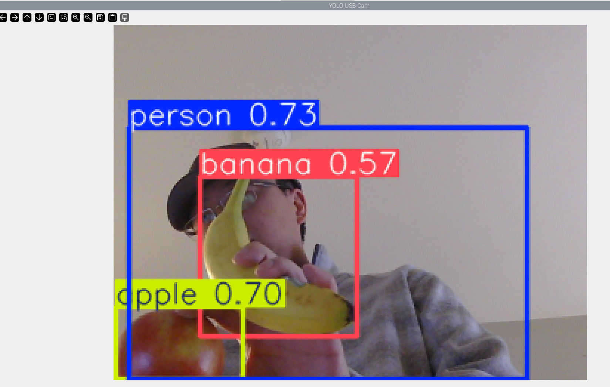

# Week 8 Mon: Computer Vision 1

---------------
#### :dizzy: **Lab Date :** Mar 2
#### :alarm_clock: **Due Date :** 2:00 pm Mar 16   
#### :pencil: Every group member must be present for every check point.
-------------------

## 1. Basic Set-up — ```Ultralytics``` and YOLO

- [ ] **Connect to the USB 3.0 of Rasp Pi.**

We have Logitech Brio 100 or Brio 101 webcam.

https://www.amazon.com/Logitech-Webcam-Meetings-Streaming-Built/dp/B0BXGFFSL1


- [ ] **Install Ultralytics**

Go to https://github.com/ultralytics/ultralytics find the installation command.

Always remember to adjust for Pi OS: ```pip3``` and ```--break-system-packages```

```Ultralytics``` automatically installation many other useful Python packages for computer vision. 

- [ ] **Download YOLO26**

Run this Python. It will download the model of YOLO26 nano model
<br> This model is released on Jan 2026.

https://docs.ultralytics.com/models/yolo26/

```python
from ultralytics import YOLO
model = YOLO("yolo26n.pt")
## n is nano model (smallest)
## .pt is the PyTorch format. 
```

- [ ] **Run YOLO26 with Camera Stream**

Run this Python.

```python
import cv2
from ultralytics import YOLO

model = YOLO("yolo26n.pt")
cap = cv2.VideoCapture(0)

while True:
    ret, frame = cap.read()
    if not ret:
        break

    small = cv2.resize(frame, (320, 240))     # force 320x240 input
    results = model.predict(small, imgsz=320, verbose=False)  # keep img small

    annotated = results[0].plot()
    cv2.imshow("YOLO USB Cam", annotated)

    if cv2.waitKey(1) & 0xFF == ord('q'):
        break

cap.release()
cv2.destroyAllWindows()
```

Place a few objects before camera and see if works!


> [!TIP]
>In Pi OS, the  ```cv2.imshow``` often conflicts with system GUI and may result to an error ```could not find the Qt platform plugin "wayland"``` . If so, you can use Python ```flask``` to display the stream on Pi's browser.

---

The objects have to be in one of the 80 categories in<br> https://github.com/ultralytics/ultralytics/blob/main/ultralytics/cfg/datasets/coco.yaml 

You can also simply check the 80 categories in Python:

```python
model = YOLO("yolo26n.pt")
print(model.names)
```



🎉 **Check Point 1**
<br> Demo if it works

## 2. **Visual Servoing with YOLO**

- [ ] In the previous code, add this right below `results = model.predict(small, imgsz=320, verbose=False)`

```python
print(results)
```

Observe what is printed out.

- [ ] Then, change the print to 
```python
results[0].speed
```
and
```python
results[0].boxes
```
Observe what is printed out.

- [ ] Refer to official doc of Ultralytics YOLO to understand them

* https://docs.ultralytics.com/modes/predict/#working-with-results

* https://docs.ultralytics.com/datasets/detect/#ultralytics-yolo-format

----

- [ ] **System Design**

Once you understand the print-out info, start to develop a simple **visual servoing system using YOLO**. In simple terms, you will use the camera feed to control a motor’s movement.

Rules (based on object location in the camera view):

* Suppose the camera view is splitted into 3 equal parts

* Object in the left region → rotate motor in a direction

* Object in the center region → STOP

* Object in the right region → rotate motor in opposite direction

Again, dont directly connect motor to your Rasp Pi !

- [ ] In addition, you should also report these metrics in your Markdown:
* Width, Height
* Model Inference Time
* FPS

🎉 **Check Point 2**

Each student must present **individually for 30 seconds** to describe personal contributions during this lab.<br>
Each student will be asked a question regarding to implementation or YOLO details.<br>
The other two students in the same group must not assist.<br>
Failure to demonstrate meaningful contribution, or answer questions will result in point loss in the corresponding Markdown submission.
