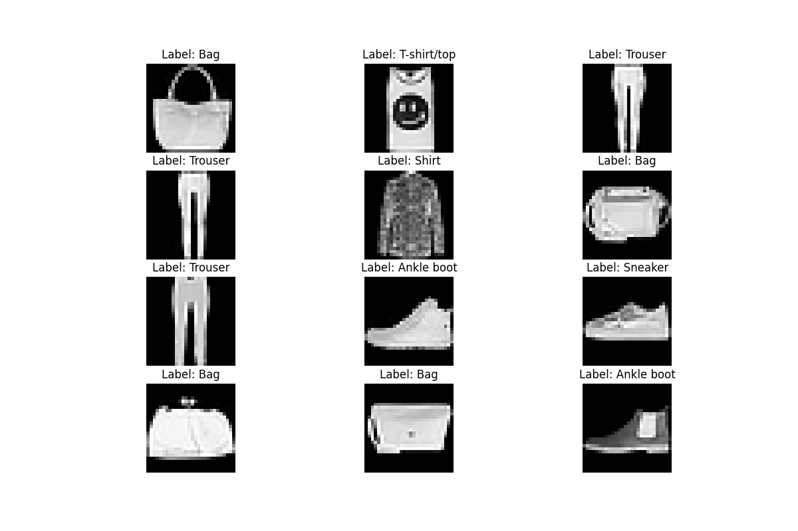
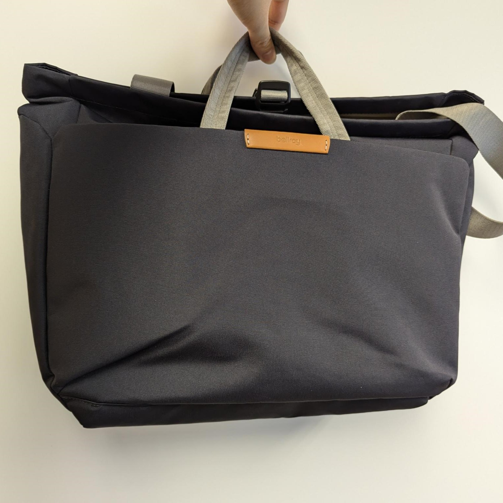
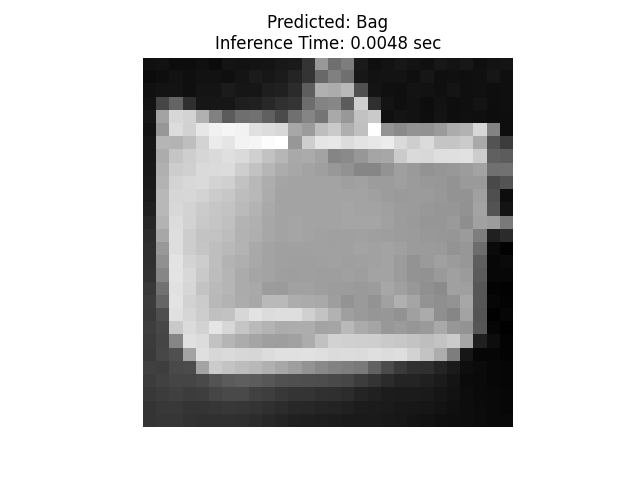

# Week 8 Wed: Computer Vision 2

---------------
#### :dizzy: **Lab Date :** Mar 4
#### :alarm_clock: **Due Date :** 2:00 pm Mar 16   
#### :pencil: Every group member must be present for every check point.
-------------------

## 3. Image Classification Workflow — Fashion MNIST

In this task, we will try the image classification workflow via deep learning. We will go thru the procedures step by step.

We will use **PyTorch** + **Torchvision** as deep vision framework. They are already installed when you installed ```Ultralytics``` 

We will try on a simple dataset -- **Fashion MNIST**.

* Dataset description: https://www.kaggle.com/datasets/zalando-research/fashionmnist
* PyTorch training details: https://pytorch.org/tutorials/beginner/introyt/trainingyt.html

----------------------

- [ ] **Prepare Training Data**

Use ```torchvision.datasets``` to download Fashion MNIST data to your local disk.

https://pytorch.org/vision/0.21/generated/torchvision.datasets.FashionMNIST.html

- [ ] **Check the Data**

Open your file folder to double check. You should have 8 files in 4 different names (4 compressed .gz, 4 raw ubyte). They are:
* training set images
* training set labels
* testing set images
* testing set labels

Start a new .py, use ```torchvision.datasets``` to load downloaded dataset. Then use ```matplotlib``` to display some images and their labels.

 

- [ ] **Train Neural Network**
> [!TIP]
> The training can be done in your own laptop or any Cloud platform (such as Google Colab) for speeding up.
> 
Start over a new .py. Use ```torch.nn``` to create a neural network. Then train the neural network in the Pi.

* Remember to do ```torch.device("cpu")``` for Pi, not ```gpu```
* Record your training time. expect to be >20 minutes.
* Save the trained model in your local disk.

```shell
>>> %Run -c $EDITOR_CONTENT
Epoch 1/10, Loss: 0.5135, Time: 135.63 sec
Epoch 2/10, Loss: 0.3023, Time: 131.29 sec
Epoch 3/10, Loss: 0.2528, Time: 130.57 sec
Epoch 4/10, Loss: 0.2234, Time: 165.76 sec
Epoch 5/10, Loss: 0.2018, Time: 163.32 sec
Epoch 6/10, Loss: 0.1779, Time: 146.26 sec
Epoch 7/10, Loss: 0.1628, Time: 157.00 sec
Epoch 8/10, Loss: 0.1448, Time: 161.22 sec
Epoch 9/10, Loss: 0.1313, Time: 162.27 sec
Epoch 10/10, Loss: 0.1145, Time: 162.21 sec
Total training time: 1515.51 sec
Model trained and saved as /home/cao/Downloads/fashion_mnist_optimized.pth
```

- [ ] **Inference with Real Image**

* Place a fashion item before a background. There are 10 accepted item types. They can be found in previous [kaggle hyperlink](https://www.kaggle.com/datasets/zalando-research/fashionmnist).

* Take a photo of it. Ensure clean background and high contrast between item and background. (I used my phone to take picture)

* Preprocess images to convert them to the same style as Fashion MNIST images. (I used my photo-edit app to crop and filter. Then I upload the image to ChatGPT and ask it to generate code that: "use opencv to preprocess the uploaded image for Fashion MNIST dataset. Ensure clear edge and good contrast." )

* Then, start over a new .py file. Use your previously trained neural networks and perform inference on the images. Also record the inference time.

* Does it predict the correct label?

| **Raw Image** |**Preprocessed then Perform Prediction** |
|---------|---------|
|  |  |

```shell
>>> %Run caopredict.py
Predicted Class: Bag
Inference Time: 0.0048 seconds
```

🎉 **Check Point 1**

------------------
## 4. Real-Time Image Classification for Embedded System  — MobileNet

In the Monday's task, when you run YOLO on Raspberry Pi 5, you may notice the frame rate is relatively low.

Instead of detecting **multiple objects + bounding boxes** (YOLO), we will simplify the problem to recognizing **a single main object** in the camera view.

* **YOLO** is for **object detection**: it finds multiple objects in an image, and outputs **{class + location/bounding box + confidence}**.
* **MobileNet** is for **image classification**: it predicts one label for the whole image, and outputs **{class + confidence}**.

Because classification is simpler than detection, it runs significantly faster on embedded platforms like Raspberry Pi.

---------

- [ ] **Pre-trained MobileNetV3-Small Model**

We will use the pretrained **MobileNetV3-Small** model provided by PyTorch:

[https://docs.pytorch.org/vision/main/models/mobilenetv3.html](https://docs.pytorch.org/vision/main/models/mobilenetv3.html)

The model is trained on the **ImageNet-1K dataset**, which contains 1000 object categories.

* Standard naming: https://github.com/pytorch/hub/blob/master/imagenet_classes.txt ; 
* Alternative American-styled naming: https://github.com/anishathalye/imagenet-simple-labels

You can get the model and check by:

```python
import torch
from torchvision.models import mobilenet_v3_small, MobileNet_V3_Small_Weights

# Load pretrained model
weights = MobileNet_V3_Small_Weights.DEFAULT
model = mobilenet_v3_small(weights=weights)
model.eval()

# Load categories
categories = weights.meta["categories"]

# Check some categories
print("Total classes:", len(categories))
print("First 10 classes:")
for i in range(10):
    print(i, ":", categories[i])
```

* [ ] **Real-Time Video Frame Classification on Raspberry Pi**

Your task is to implement a **real-time video frame classification system** using the **MobileNetV3-Small** model (ImageNet pretrained).

* Use a live USB camera stream on the Raspberry Pi.
* Capture video frames continuously.
* For each video frame:

  * Perform MobileNetV3-Small inference.
  * Compute the Top-1 predicted class label.
  * Compute the corresponding confidence score.
* Overlay the following information directly on the live video stream: 

  * Predicted label
  * Confidence 
  * FPS
  
> [!TIP]
>In Pi OS, the  ```cv2.imshow``` often conflicts with system GUI and may result to an error ```could not find the Qt platform plugin "wayland"``` . If so, you can use Python ```flask``` to display the stream on Pi's browser.
> 
>You can use `cv2.putText` to overlay text.


----------
Here are 2 screenshots of my running (This is using ```flask``` package and display in a browser):

| **Screenshot 1** |**Screenshot 2** |
|---------|---------|
|  |  |

🎉 **Check Point 2**
