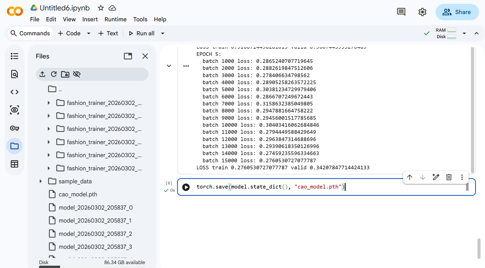

# Week 8 Wed: Computer Vision 2

---------------
#### :dizzy: **Lab Date :** Mar 4
#### :alarm_clock: **Due Date :** 2:00 pm Mar 16   
#### :pencil: Every group member must be present for every check point.
-------------------

## 1. Image Classification Workflow — Fashion MNIST

In this task, we will try the deep-learning-based image classification workflow with embedded device. We will go thru the procedures step by step.

We will use **PyTorch** + **Torchvision** . They are already installed when you installed ```Ultralytics``` 

We will try on a simple dataset -- **Fashion MNIST**.

* Dataset description: https://www.kaggle.com/datasets/zalando-research/fashionmnist
* PyTorch Fashion MNIST Tutorial details: https://pytorch.org/tutorials/beginner/introyt/trainingyt.html

----------------------

- [ ] **Model Training: Follow the PyTorch Fashion MNIST Tutorial**

* Typically, you don't want to train model in embedded devices due to limited computation resources.
<br>So, use either your own laptop or Cloud platform to train the model.
<br>I recommend that you just use Google Colab because PyTorch is already there without extra installation.

* You can direct use the code blocks given in the official tutorial. Just one adjustment:
<br>For Optimizer: change from `optimizer = torch.optim.SGD(model.parameters(), lr=0.001, momentum=0.9)` to `optimizer = torch.optim.Adam(model.parameters(), lr=0.001)`

- [ ] **Model Saving**

Once training completed, save the trained weights

```python
torch.save(model.state_dict(), "my_model.pth")
```
Move this .pth to Raspberry Pi.


| **Save model as .pth after training done** |
|---------|
|  |

- [ ] **Inference with Real Image**

* In Rasp Pi, load the .pth model using the same Neural Network architecture.

```python
import torch
import torch.nn as nn
import torch.nn.functional as F

# Use the exact same Neural Network architecture in training
class GarmentClassifier(nn.Module):
    ........
    .........

model = GarmentClassifier()

model.load_state_dict(torch.load("my_model.pth", map_location="cpu"))
model.eval()
print("Model loaded successfully on Raspberry Pi")
```

* Next, try running Neural Network inference with a new image (not from the Fashion-MNIST dataset).
<br> You may take a picture of your stuff or download any image online. Then preprocess it to match the Fashion-MNIST style (28×28, grayscale, clear contrast).
<br> I provide a code that can preprocess from a **square shape image** to Fashion-MNIST style image, in Folder "Asset -> Image Preprocess"

* Now, perform inference on your image using the trained .pth model on the Raspberry Pi.
<br>Print the predicted item label.
<br>Print the inference time
<br>Note: the mapping from predicted class index to item label can be found in https://www.kaggle.com/datasets/zalando-research/fashionmnist (About Dataset->View More)

```python
# This is a Minimal Example
from PIL import Image
import torch
import torchvision.transforms as transforms

transform = transforms.Compose([
    transforms.ToTensor(),
    transforms.Normalize((0.5,), (0.5,))
])

img_path = "my_image.png"
pil_img = Image.open(img_path).convert("L")

img_t = transform(pil_img)      
images = img_t.unsqueeze(0)     

# Inference
with torch.no_grad():
    outputs = model(images)
    pred = outputs.argmax(dim=1).item()

print("Predicted class index:", pred)
```

🎉 **Check Point 1**


------------------
## 2. Real-Time Video Frame Classification  — MobileNet

In the Monday's task, when you run YOLO on Raspberry Pi 5, you may notice the frame rate is relatively low (less than 20 FPS).

Instead of detecting **multiple objects + bounding boxes** (YOLO), we will simplify the problem to recognizing **a single main object** in the camera view.

* **YOLO** is for **object detection**: it finds multiple objects in an image, and outputs **{class + location/bounding box + confidence}**.
* **MobileNet** is for **image classification**: it predicts one label for the whole image, and outputs **{class + confidence}**.

Because classification is simpler than detection, it runs significantly faster on embedded platforms like Raspberry Pi.

---------

- [ ] **Pre-trained MobileNetV3-Large Model**

We will use the pretrained **MobileNetV3-Large** model provided by PyTorch:

[https://docs.pytorch.org/vision/main/models/mobilenetv3.html](https://docs.pytorch.org/vision/main/models/mobilenetv3.html)

The model was published in 2019: https://arxiv.org/abs/1905.02244  . 
<br>It is trained on the **ImageNet-1K dataset**, which contains 1000 object categories.

* Standard naming: https://github.com/pytorch/hub/blob/master/imagenet_classes.txt ; 
* Alternative American-styled naming: https://github.com/anishathalye/imagenet-simple-labels

- [ ] **Optimize for Embedded Device**

Instead of using the default implementation, you should apply a few embedded-friendly optimizations:

* Limit PyTorch CPU threads, leave room for other tasks such as OpenCV pre-processing, Flask streaming, ...
* Use int8 quantization to speed up CPU inference
* Use QNNPACK as the quantized backend (optimized for ARM CPUs)
  
> [!TIP]
> A detailed explanation of these optimizations can be found in the article:
[https://docs.pytorch.org/tutorials/intermediate/realtime_rpi.html](https://docs.pytorch.org/tutorials/intermediate/realtime_rpi.html)
> 
> Note, this article uses MobileNetV2 and doen't use a USB camera, but the same optimization ideas.

The optimized model can be verified using the following code:
  
```python
import torch
from torchvision.models.quantization import mobilenet_v3_large, MobileNet_V3_Large_QuantizedWeights

torch.set_num_threads(2)
torch.backends.quantized.engine = "qnnpack"

# Load quantized V3-Large
weights = MobileNet_V3_Large_QuantizedWeights.DEFAULT
model = mobilenet_v3_large(weights=weights, quantize=True).eval()

# JIT
model = torch.jit.script(model)

print("MobileNetV3-Large INT8 loaded successfully.")
```

* [ ] **Real-Time Video Frame Classification on Raspberry Pi**

Your task is to implement a **real-time video frame classification system** using the **MobileNetV3-Large** model (ImageNet pretrained).

* Use a live USB camera stream on the Raspberry Pi.
* Capture video frames continuously.
* For each video frame:

  * Perform MobileNetV3-Large inference.
  * Compute the Top-1 predicted class label.
  * Compute the corresponding confidence score.
* Overlay the following information directly on the live video stream: 

  * Predicted label
  * Confidence 
  * FPS

* CPU thread usage inspection (You can use `htop` in Terminal)
  * Provide a screenshot of CPU thread usage when `torch.set_num_threads(2)`
  * Provide a screenshot of CPU thread usage when set threads to other numbers such as 1 or 4.

> [!TIP]
>In Pi OS, the  ```cv2.imshow``` often conflicts with system GUI and may result to an error ```could not find the Qt platform plugin "wayland"``` . If so, you can use Python ```flask``` to display the stream on Pi's browser.
> 
>You can use `cv2.putText` to overlay text.


----------
Here are 3 screenshots of my running (This is using ```flask``` package and display a real-time steam in a browser):

| **Screenshot 1** |**Screenshot 2** |**Screenshot 3** |
|---------|---------|---------|
|  |  | |

🎉 **Check Point 2**

Each student must present **individually for 30 seconds** to describe personal contributions during this lab.<br>
Each student will be asked a question regarding to implementation.<br>
The other two students in the same group must not assist.<br>
Failure to demonstrate meaningful contribution, or answer questions will result in point loss in the corresponding Markdown submission.
