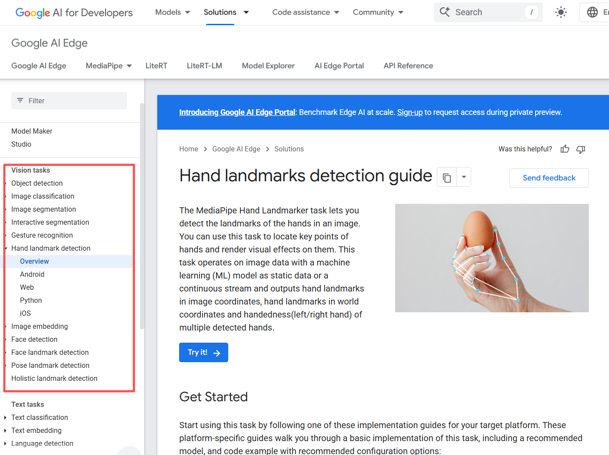

# Week 9 Mon: MediaPipe Edge AI

---------------
#### :dizzy: **Lab Date :** Mar 16
#### :alarm_clock: **Due Date :** 2:00 pm Mar 23  
#### :pencil: Every group member must be present for every check point.
-------------------

## 1. The Usage of MediaPipe Studio

The first task is to deploy these 2 out of the following 5 use cases from Google MediaPipe examples for Raspberry Pi.

#### Pick 2 out of these 5:

* Gesture Recognize:  https://github.com/google-ai-edge/mediapipe-samples/tree/main/examples/gesture_recognizer/raspberry_pi

* Hand Landmark:  https://github.com/google-ai-edge/mediapipe-samples/tree/main/examples/hand_landmarker/raspberry_pi

* Face Detect:  https://github.com/google-ai-edge/mediapipe-samples/tree/main/examples/face_detector/raspberry_pi

* Face Landmark:  https://github.com/google-ai-edge/mediapipe-samples/tree/main/examples/face_landmarker/raspberry_pi

* Pose Landmarke:  https://github.com/google-ai-edge/mediapipe-samples/tree/main/examples/pose_landmarker/raspberry_pi
  
--------

- [ ] For sure, you need to install MediaPipe first.
- [ ] Then, in each GitHub Repo, it may tell you to do `sh setup.sh`. I don't recommend run this.  Instead, read the `setup.sh` file, only run the last one `wget .....` in Terminal.
- [ ] For each use case, understand how those parameters work and try to modify them.  You can find brief explanation in the GitHub Repo README.  You can also find detailed explanation in the Google website. https://ai.google.dev/edge/mediapipe/solutions/studio
- [ ] You may need to double-check the frame size. In some default codes, it is set to be too large, such as 1280x960.

| **Detailed explanation on Google website for example** https://ai.google.dev/edge/mediapipe/solutions/vision/hand_landmarker |
|---------|
|  |

🎉 **Check Point 1**

Demo the deployment

> If you can deploy 4 out of 5 use cases.
>
> can get **3/20 extra points back** in one single previous Markdown submission. (reach out to TA to recover your points)

---------

## 2. Hardware–Software Integration with MediaPipe

The second task today is an open-ended design of hardware–software integration.

Specifically, you will extend **one MediaPipe use case from Task 1** and connect the AI detection result to a **physical hardware output device** on Raspberry Pi.

Simply saying, use MediaPipe result to control a real device.

The "hardware output device" may include any of the following:

* LED
* Buzzer
* Motor
* Relay
* Small OLED display
* ...

You are free to pick any one you prefer and build your own system.
  For examples: 
* Gesture controlled LED;
* Hand landmark controlled servo motor;
* Face detection → alarm buzzer;
* ...

---

🎉 **Check Point 2**

Each student must present **individually for 30 seconds** to describe personal contributions during this lab. 
Each student will be asked a question regarding to implementation. 
The other two students in the same group must not assist. 
Failure to demonstrate meaningful contribution, or answer questions will result in point loss in the corresponding Markdown submission.
